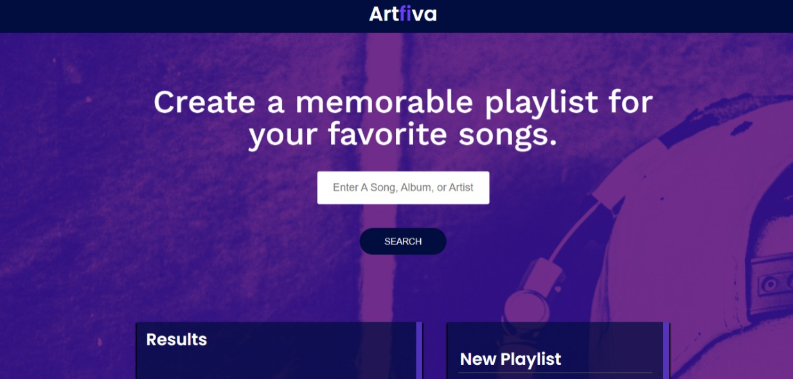

# Artfiva

Create a memorable playlist for your favorite songs.
> Live demo [_here_](http://artfiva.surge.sh). <!-- If you have the project hosted somewhere, include the link here. -->

## Table of Contents

* [General Info](#general-information)
* [Technologies Used](#technologies-used)
* [Features](#features)
* [Screenshots](#screenshots)
* [Usage](#usage)
* [Project Status](#project-status)
* [Improvement to be made](#improvement-to-be-made)
* [Acknowledgements](#acknowledgements)
* [Contact](#contact)
<!-- * [License](#license) -->

## General Information

A ReactJS project using Spotify's API to search for songs or albums, create and save playlists to your Spotify's account. This project is a capstone project for introduction to ReactJS Library.
<!-- You don't have to answer all the questions - just the ones relevant to your project. -->

## Technologies Used

* HTML - version 5
* CSS - version 3
* JavaScript ES6 (ReactJs) - version 17.0.2

## Features

* Search for songs or albums
* Add songs or albums to playlist
* Save playlist to Spotify account

## Screenshots

<!-- If you have screenshots you'd like to share, include them here. -->

## Usage

`npm install`

`npm start`

## Project Status

Project is: _in progress_.

## Improvements to be made

* Create an account
* Search and save playlist to soundcloud and other music streaming platforms.
* Update UI/Ux

## Acknowledgements

* This project was based on [Codecademy Full-Stack Engineer](https://www.codecademy.com/learn/paths/full-stack-engineer-career-path).

## Contact

Created by [@asammoahpt](https://twitter.com/asamoahpt/) - feel free to contact me!

<!-- Optional -->
<!-- ## License -->
<!-- This project is open source and available under the [... License](). -->

<!-- You don't have to include all sections - just the one's relevant to your project -->
